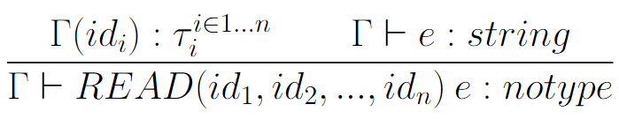

<h3> Esecuzione</h3>
La Continuous Integration è testata e funziona. Risulta possibile lanciare
un test da una qualsiasi cartella.

Nella classe "Tester" è presente il main. Per non interferire con l'esecuzione automatica dei test della CI,
è stata commentata, al suo interno, la funzionalità che permette sia di generare il file compilato di C, sia di eseguire
lo stesso. Se la si vuole provare, basterà togliere il commento da quella parte di codice (funziona sotto Windows, non testato per altri ambienti).

In alternativa, è presente il Jar con tutte le dipendenze pronto per l'esecuzione nella cartella /target.
Un esempio del suo utilizzo (sempre sotto ambiente Windows e con Cgywin) è presente in NewLangCompiler.bat.


<h3> Scelte implementative </h3>

* Nelle dichiarazioni delle variabili all'interno dei costrutti, lo shadowing è applicato sulla base delle tabelle dei simboli create nella prima visita del syntax tree.
Ad esempio, il codice:

```
integer c << 10;

start: def mainfun():void{
    integer b << c;
    integer c << 9;
    for i<<3 to 1 loop{
        integer c<<b;
        integer b<<1;
    }
}
```
Diventerà
```
int c = 10;

void mainfun(){

	int c = 9;
	int b = c; //b assume valore 9
	for(int i = 3; i >= 1; i--){

		int b = 1;
		int c = b;
	}
}
```
Quando, nella generazione di codice C, si fa il lookup della variabile c (per integer b << c;), questa è già presente nella tabella relativa a mainfun, in quanto inserita nella prima visita. Tuttavia, c sarà marcata come non assegnata. Per avere shadowing in combinazione con la proprietà di poter dichiarare una variabile dopo l'utilizzo, la lookup non procederà alla tabella globals (dove c è già assegnato). Dunque, il generatore di codice C cercherà di ordinare correttamente le assegnazioni (VarDecl).

Un approccio alternativo (SCARTATO) è quello di cercare le variabili anche nelle tabelle di livello più alto, qualora queste non fossero assegnate nella tabella corrente. In quel caso, il codice sopra diventerebbe:
```
int c = 10;

void mainfun(){

	int b = c; //b assume valore 10
	int c = 9
	for(int i = 3; i >= 1; i--){

		int b = 1;
		int c = b;
	}
}
```

* Non è possibile, per limitazioni del linguaggio C, assegnare nient'altro che costanti alle variabili globali.

* All'inizio dei file C, vengono definite alcune funzioni utili per la compatibilità tra i tipi di c e i tipi (e le operazioni permesse su di essi) di NewLang.

* Per il tipo booleano, è possibile usare in input sia 0/1 che false/true.

* Non è possibile l'overloading.
<h3>Type System</h3>

Aggiunte al type system dato sul sito, le seguenti regole:

<h4>Read</h4> <br>


<h4>Read con scrittura precedente</h4> <br>


<h4> Write </h4>


<h4>Chiamata a funzione con ritorno e  controllo parametri out </h4>
NB: k ed n sono >= 0, ma non ci sono vincoli su quale sia più grande, né sull'ordinamento


<h4>Chiamata a funzione senza ritorno (stat) e  controllo parametri out </h4>


Inerentemente alle regole di tipo, si riportano i casi limite per la tabella optype2 riportata nella specifica su E-learning:
Tutte le operazioni di moltiplicazione, addizione, potenza, divisione, sono applicabili solo su interi e float.
 Il risultato dell'operazione è float laddove almeno uno dei due operatori sia float, intero altrimenti.

La concatenazione STR_CONCAT (&), è permessa non solo tra due stringhe, ma su tutti i tipi presenti nel linguaggio.
 Ad esempio, è possibile usare STR_CONCAT su un intero e un float, ma il risultato sarà sempre una stringa.


L'unica compatibilità di tipo presente è tra interi e float: è possibile assegnare un intero ad un float, ma non viceversa.
